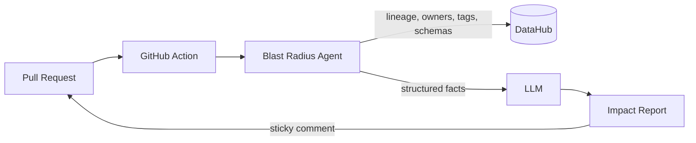

# 💥 Blast Radius

**A lineage-aware AI review agent that tells you what your data change will break — before you merge.**

Built for [**Build with DataHub: The Agent Hackathon**](https://datahub.devpost.com) · Powered by [DataHub](https://datahub.com), the open-source Context Platform


---

## 📌 The Problem

In most companies, data flows through a long chain: raw sources → staging models → business tables → executive dashboards. When an engineer changes one model — renames a column, drops a field — they usually have no idea what sits downstream. The breakage surfaces days later, when a dashboard silently shows wrong numbers.

**Blast Radius closes that gap.** On every pull request, an AI agent queries DataHub's lineage graph, computes the downstream impact of the change, and posts a clear, actionable report directly on the PR — affected dashboards, severity, PII warnings, and the owners who need to know.

## ✨ What It Does

When a PR touches any dbt model, Blast Radius automatically:

- 🔍 **Maps changed files to data assets** in DataHub (dbt model → dataset URN)
- 🕸️ **Traverses downstream lineage** to find every affected table, view, and dashboard
- 🚨 **Detects breaking changes** by diffing SQL for dropped/renamed columns (via `sqlglot`)
- 🔐 **Flags PII exposure** when affected assets carry a `PII` tag
- 👥 **Identifies owners** of impacted assets so the right people get looped in
- 🤖 **Writes a concise impact report** — severity score and an affected-assets table — posted as a single sticky PR comment (optionally polished by an LLM that is never allowed to invent assets)

### Example PR comment

> ### 🔴 Blast Radius: HIGH severity
>
> **Changed model:** `stg_orders` — column `order_total` dropped
>
> | Affected asset | Type | Owner |
> |---|---|---|
> | `revenue_daily` | Table | @alice |
> | `Executive Revenue Dashboard` | Dashboard | @alice |
> | `Customer 360` | Dashboard | @bob |
>
> ⚠️ `stg_customers` is tagged **PII** — review before merging.

## 🏗️ Architecture



1. A GitHub Action triggers on PRs touching `models/**`.
2. The agent resolves changed dbt models to DataHub URNs.
3. It queries DataHub for downstream lineage, ownership, and tags via the [GraphQL API](https://docs.datahub.com/docs/api/datahub-apis) (see also the [DataHub MCP Server](https://docs.datahub.com/docs/features/feature-guides/mcp)).
4. A rule engine scores severity (dropped column used downstream = HIGH; PII asset affected = HIGH; additive change = LOW).
5. An LLM turns the structured facts into a readable Markdown report — **it is never allowed to invent assets.**
6. The report is posted as a single, continuously updated PR comment.

## 🚀 Getting Started

### Prerequisites

- Docker Desktop (for local DataHub)
- Python **3.10+**
- An Anthropic API key *(optional — used only to polish the report)*

### 1. Run DataHub locally

```bash
python -m pip install --upgrade acryl-datahub
datahub docker quickstart
```

Then open <http://localhost:9002> (login `datahub` / `datahub`) and generate an access token (**Settings → Access Tokens**).

### 2. Build and ingest the demo dbt project

```bash
pip install -r requirements.txt
pip install dbt-duckdb            # local dbt engine (no warehouse needed)

dbt seed --profiles-dir .
dbt run --profiles-dir .

export DATAHUB_URL="http://localhost:8080"
export DATAHUB_TOKEN="<your-datahub-token>"

dbt docs generate --profiles-dir .
datahub ingest -c dbt_recipe.yml

python scripts/emit_dashboards.py   # demo dashboards, owners, and PII tags
```

### 3. Run the agent manually

```bash
export ANTHROPIC_API_KEY="<your-llm-key>"   # optional
python blast_radius.py --changed-files models/staging/stg_orders.sql --output report.md
```

### 4. Enable the GitHub Action

Add these repository secrets (**Settings → Secrets and variables → Actions**):

| Secret | Description |
|---|---|
| `DATAHUB_URL` | Public URL of your DataHub instance (use an ngrok tunnel for local demos) |
| `DATAHUB_TOKEN` | DataHub personal access token |
| `ANTHROPIC_API_KEY` | LLM API key *(optional)* |

The workflow at [`.github/workflows/blast-radius.yml`](.github/workflows/blast-radius.yml) runs on every PR that touches `models/**` and posts the impact report automatically.

## ⚙️ Configuration

| Variable | What it is | Where to get it |
|---|---|---|
| `DATAHUB_URL` | DataHub backend URL | `http://localhost:8080` for local quickstart |
| `DATAHUB_TOKEN` | DataHub access token | DataHub UI → **Settings → Access Tokens** |
| `ANTHROPIC_API_KEY` | LLM key for report polishing *(optional)* | [console.anthropic.com](https://console.anthropic.com) |
| `BASE_REF` | Git ref to diff against | Set automatically by CI (defaults to `origin/main`) |

## 📁 Project Structure

```text
.
├── blast_radius.py            # Agent entrypoint: diff → lineage → severity → report
├── requirements.txt           # Python dependencies
├── dbt_project.yml            # Demo dbt project (jaffle_shop)
├── profiles.yml               # Local DuckDB profile
├── dbt_recipe.yml             # DataHub ingestion recipe
├── seeds/                     # Demo source data (CSV)
├── models/
│   └── staging/               # Cleaned source models (stg_orders, stg_customers, stg_payments)
├── scripts/
│   └── emit_dashboards.py     # Emits demo dashboards, owners & PII tags to DataHub
└── .github/workflows/
    └── blast-radius.yml       # CI workflow that posts the PR comment
```

## 🧠 How Severity Is Scored

Severity is **rule-based, not vibes-based**:

| Condition | Severity |
|---|---|
| Dropped/renamed column referenced by a downstream asset | 🔴 HIGH |
| Any affected asset tagged `PII` | 🔴 HIGH |
| Downstream dashboards affected, no schema break detected | 🟡 MEDIUM |
| Additive-only change (new columns, new models) | 🟢 LOW |

The LLM only narrates facts collected from DataHub and the SQL diff.

## 🏆 Hackathon Judging Criteria

- **Use of DataHub** — lineage traversal, ownership, tags, and schema metadata drive every decision the agent makes.
- **Technical execution** — end to end: PR opened → CI → DataHub queries → severity engine → report comment.
- **Originality** — impact analysis at PR time, where the merge decision actually happens; not another "chat with your catalog."
- **Real-world usefulness** — every data team with dbt + GitHub feels this pain weekly.
- **Submission quality** — reproducible demo (seeded dbt project + one-command DataHub), clear README, CI included.

## 🗺️ Roadmap

- [ ] Write-back to DataHub: raise **incidents** on high-severity assets so the risk lives in the catalog
- [ ] Auto-request PR reviews from downstream asset owners
- [ ] Slack notifications for HIGH-severity changes
- [ ] Auto-drafted migration notices for affected teams

## 🙏 Acknowledgements

- [DataHub](https://github.com/datahub-project/datahub) — the open-source metadata platform powering lineage, ownership, and tags
- [DataHub MCP Server](https://docs.datahub.com/docs/features/feature-guides/mcp) — agent-native access to DataHub context
- [dbt](https://www.getdbt.com/) & the Jaffle Shop example project

## 📄 License

Released under the **Apache License 2.0** — see [`LICENSE`](LICENSE) and [`NOTICE`](NOTICE).
